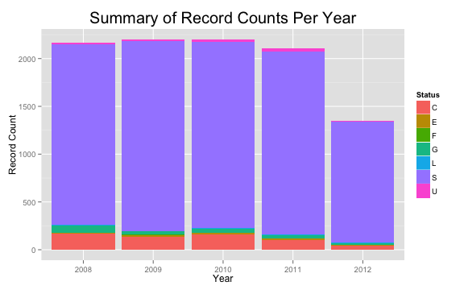

## Stolen Gun Data In Houston


In 2012, The Houston Chronicle compiled data on guns that were stolen in the Houston area.  They determined that, in the data they collected over 5 years, only 7% of guns are returned.


```
##           Status    N
## 1:    Stolen (S) 9016
## 2:   Cleared (C)  604
## 3:   General (G)  199
## 4: Unfounded (U)   87
## 5:  Evidence (E)   64
## 6:      Lost (L)   40
## 7:     Found (F)    7
```

--- .class #id 

## Shiny Web Application

There are approximately 2000 records of stolen guns per year in the data set.


The web app allows users to visually explore the data that the the newspaper collected to spot some of the attributes that appear most frequently in the data.


 


---

## Attribute Options

The application takes the Top 20 attributes for all of the stolen gun incidents and graphs them.

Users can chose to see the greatest numbers by: <br/>
<ul data-columns="2">
        <li>Location Guns Were Stolen From</li>
        <li>Type Of Weapon</li>
        <li>ZIP Code</li>
        <li>Criminal Offense</li>
        <li>Gun Make</li>
        <li>Caliber</li>
        <li>Street Address</li>
    </ul>
    
You can also chose which year you want the graph to display.  
There Chronicle's data starts in 2008 and was collected until August 2012.


---

##  Example Graph: Top Stolen Locations for 2011

 


